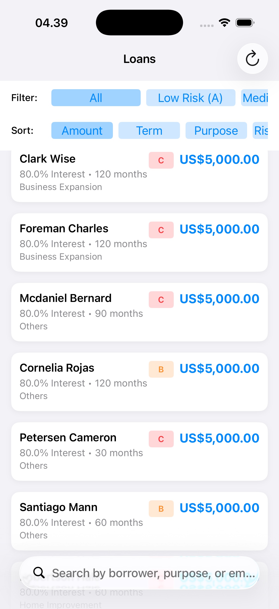
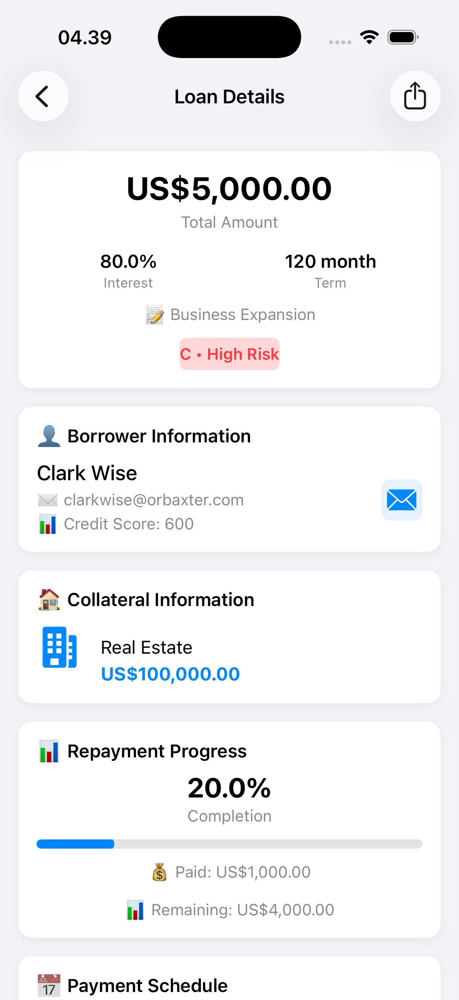

# Manloan App 🚀
iOS application that allows users to view and manage loan details
| Loan List | Loan Details |
|-----------|--------------|
|  |  |

## 🚀 Tech Stack
- MVVM + Clean Architecture (for easier testing)
- UIKit
- Swinject (for reduce boilerplate)
- Combine (for implement reactive programming)
- Alamofire (for reduce boilerplate and more advanced feature)
- KingFisher (for automatic memory & disk caching on image load from URL)
- Unit Test
- Multi Module 

## 🚀 How To Use
1. Clone the Repository using Xcode 26.6
2. Run code on iOS device (tested on iOS 26)

## 🚀 Additional Feature (for enhance user experience):
1. Loan List Screen: 
    - filter
    - sort
    - search
    - pull to refresh
    - loading animation when data fetching
    
2. Loan Detail Screen: 
    - repayment progress(paid, percentage paid/amount)
    - data propagation from Loan List Screen (not re-fetch from API endpoint) to reducing reliance on the internet
    - smooth animation on progress bar of percentage paid/amount
    - auto hide collateral section if no collateral item
    - summary card (amount, interest rate, term, purpose, risk rating)
    - send email (to borrower to remind with pre filled subject and body)
    - share loan detail via other app (WA, Telegram, etc)
    
3. Loan Document Screen: 
    - preload image before showing image (for prevent lagging when first zooming)
    - loading animation when image loading
    - swipe down to dismiss
